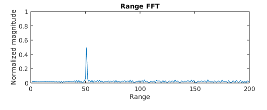

# SFND_Radar
SensorFusionNanoDegree Radar Signal Processing Project

## Introduction

The purpose of the project was to use MATLAB to first simulate radar signals from a moving vehicle, then process those signals to retrive the range and speed. The project follows these steps:

1. Calculate the parameters of the FMCW (Frequency Modulated Continuous Wave) waveform given requirements;
2. Set range and speed of a target and simulate its radar signal;
3. Generate the radar signature by mixing the transmitted and returned signals to generate the beat frequency;
4. Perform range FFT on the beat signal to determine the range set in step 2;
5. Perform 2D range and doppler FFT to reveal the range and velocity;
6. Perform CFAR (Constant False Alarm Rate) analysis to track the target in the 2D FFT map from step 5.

The sequence of operations is shown in the figure below


The matlab code to perform the operations is included in the main directory. The code is contained in the file 'RadarProject.m.' Parts of that file will be copied to this page and discussed to explain how the above steps were performed.

## FMCW Signal Design


The figure above shows the characteristics of the FMCW radar signal. Over the time span 'Ts' the transmitted signal frequency is ramped up from a base carrier frequency (fc), then dropped and ramped up again. The sawtooth frequency ramps are called 'chirps.' A chirp is defined by its 'slope' of chirp frequency bandwidth 'B' over chirp time 'Ts', 'slope=B/Ts.' The range to a target is determined by the frequency difference between emitted and received frequencies, shown as 'fb' or beat frequency. The generation of the beat frequency is done by subtracting received from transmitted signal, an operation called 'mixing.'

The chirp bandwidth is related to the required range resolution; smaller the resolution, higher the bandwidth. Chirp time is related to the maximum range of a target; greater the range, longer the sweep time.

From the code:

```
%%%%%%%%%%%%%%%%%%%%%%%%%%%
% Frequency of operation = 77GHz
% Max Range = 200m
% Range Resolution = 1 m
% Max Velocity = 100 m/s
%%%%%%%%%%%%%%%%%%%%%%%%%%%

r_resolution = 1; % range resolution
r_max = 200;      % maximum radar range
c = 3e8;          % speed of light

B = c/r_resolution/2;    % sweep height
Tchirp = 5.5*2*r_max/c;  % 5.5*max_round_time=5.5*(2*rMax/c)
Slope = B/Tchirp;
```

## Radar Signature

This section explains the simulation of a moving target--intial range and speed, assumed constant is set--and the signals transmitted and received from it using our FMCW design above.

The signal of a FMCW transmitter is:

_Tx = cos (2*pi*(fc + Slope*t/2)*t)_

The return signal is the same except for a shift in time, t-Tau

_Rx = cos (2*pi*(fc + Slope*(t-Tau)/2)*(t-Tau))_

Tau simly is the time is takes the signal to make the roundtrip from the tranmitter/receiver to the target

_Tau = 2*range/c_

From the code:

```
for i=1:length(t)

    % For each time stamp update the Range of the Target for constant velocity.
    t = i*Tchirp/Nr;
    r = ro + vo*t;

    % For each time sample we need update the transmitted and
    % received signal.
    Tx(i) = cos(2*pi*(fc + 0.5*Slope*t)*t);

    td = t - (2*r/c);  % signal round time to transmitter
    Rx(i) = cos(2*pi*(fc + 0.5*Slope*td)*td);

    % Now by mixing the Transmit and Receive generate the beat signal
    % This is done by element wise matrix multiplication of Transmit and

    % Receiver Signal
    Mix(i) = Tx(i).*Rx(i);  % order is immaterial

end
```


## Range FFT

The Range FFT should reveal the initial range given to the simulated vehivle, which was 50m. From the code:

```
 % reshape the vector into Nr*Nd array.
 %  Nr and Nd here would also define the size of Range & Doppler FFT's resp.
 map = reshape (Mix,[Nr,Nd]); % each column is a 'chirp' or Nr samples

 % run the FFT on the beat signal along the range bins dimension (Nr) and
 % normalize.
 map_fft = fft(map,Nr);

 % Take the absolute value of FFT output
 map_fft = abs(map_fft)/Nr;


 % Output of FFT is double sided signal, but we are interested in only one side of the spectrum.
 % Hence we throw out half of the samples.
 map_fft=map_fft(1:Nr/2+1);
 map_fft(1:end-1) = map_fft(1:end-1)*2;

 %plotting the range
 figure ('Name','Range from First FFT')
 subplot(2,1,1)

  % plot FFT output
  plot(map_fft);
  title('Range FFT');
  xlabel('Frequency');
  ylabel ('Normalized magnitude');
  axis ([0 200 0 1]);
```

Image below is the plot, 'Range FFT'.



## 2D Range/Doppler FFT

The figure below show the results of performing 2D FFT on the collection of chirps generated above.


## Target Detection

Target detection is the process of isolating signals representing targets from random signal noise. As seen in the Range Doppler Map above, a distinctive signal peak is present. This peak is the radar signature of the vehicle simluated above. When there are numerous targets in a radar's view, multiple peaks rise above the noise floor in the Range Doppler Map. Targets are isolated and detected by reshaping the Range Doppler Map. Mathematically, the operation is thresholding; the noise floor is dropped to absolute zero and target peaks narrowed and raised to value of one.

The Constant False Alarm Rate or CFAR method was implemented. The figure below explains the approach.


Every cell in the Range Doppler Map is investigated by comparing its value to values of surrounding cells. If the cell, called the 'CUT', has higher value than the average of the surrounding cells, the 'Training cells,' it is elevated to one else dropped to zero. 'Guard' cells around the CUT are left out of the averaging process. This is to isolate the CUT from neighboring cells. A strong CUT is likely to 'bleed' into neighboring cells thus raising the estimate of its surrounding noise floor.

The image below is the result of applying CFAR thesholding on the Range Doppler Map above.


Key to CFAR is setting the parameters of number of training and guard cells. Generally, in a dense target scenario with many peaks closely spaced, the number of training cells is kept low. In a target sparse scenario the number of traning cells can be raised. For strong signals, number of guard cells is high and low in weaker signal environments. With a given set of training and guard cells, a cell's surrounding noise level can be accurately estimated. To ensure that the CFAR threshold rises above random noise peaks, an additional offset is added.

From the matlab code,

```
patch = (2*(Tr+Gr)+1)*(2*(Td+Gd)+1);
core = (2*Gr+1)*(2*Gd+1);

for i=Tr+Gr+1:(Nr/2)-(Gr+Tr)
    for j=Td+Gd+1:Nd-(Gd+Td)
       noise_level=0;
       % We have a (2(Tr+Gr)+1)x(2(Td+Gd)+1) patch to sum over
       for p=i-(Tr+Gr):i+(Tr+Gr)
           for q=j-(Td+Gd):j+(Td+Gd)
              if (abs(j-q) > Gd || abs(i-p) > Gr)
                   noise_level=noise_level+db2pow(RDM(p,q));
              end
           end
       end
       % Set the 'threshold' by averaging...
       threshold=pow2db(noise_level/(patch-core));
       % ...and adding SNR offset
       threshold=threshold + offset;

       % Clip the CUT against the threshold
       CUT=RDM(i,j);
       if(CUT<threshold)
            RDM(i,j) = 0;
       else
            RDM(i,j) = 1;
       end
   end
end
```
Note that because of the training and guard cells around the cut, a band of cells all around the perimeter of the Range Doppler Map will not be tested. Those are set to zero.

```
RDM(RDM ~= 0 & RDM ~= 1 ) = 0;

```

The present case is simple with only one target and a clean signal. It was found that the number of guard and training was non-critical; counts could be kept low with results generally good. The offset exhibited a more pronounced effect; below a certain value (approx 10db) the target was lost in the noise floor.

From the code,
```
Tr=4; %10
Td=4;  %8

%Select the number of Guard Cells in both dimensions around the Cell under
%test (CUT) for accurate estimation
Gr=2; %4
Gd=2; %d

% offset the threshold by SNR value in dB
offset=10;

```
